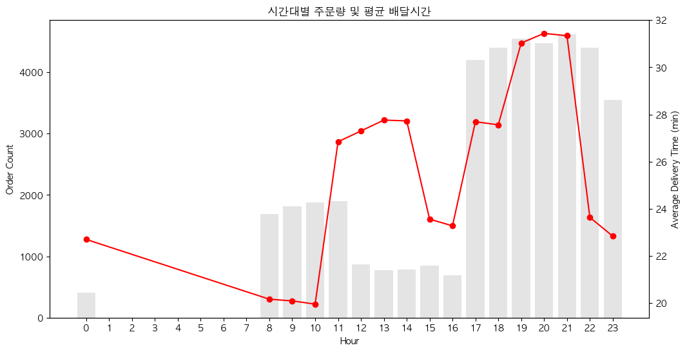
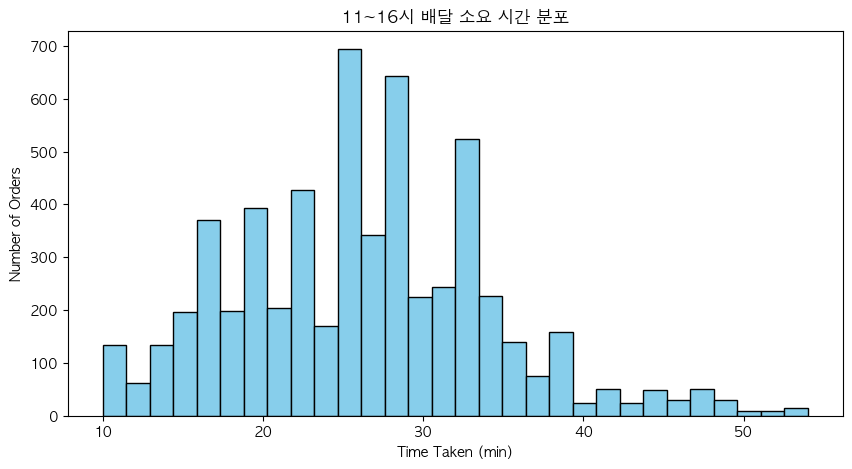
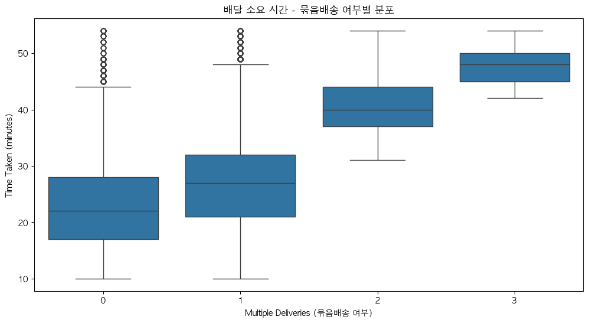
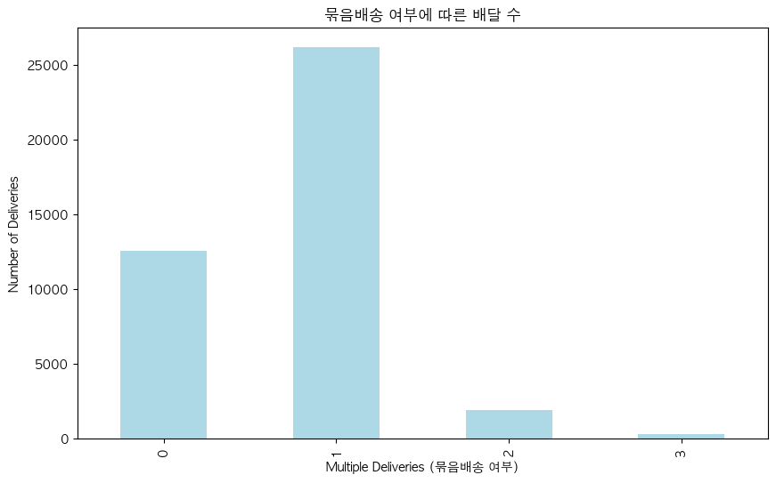
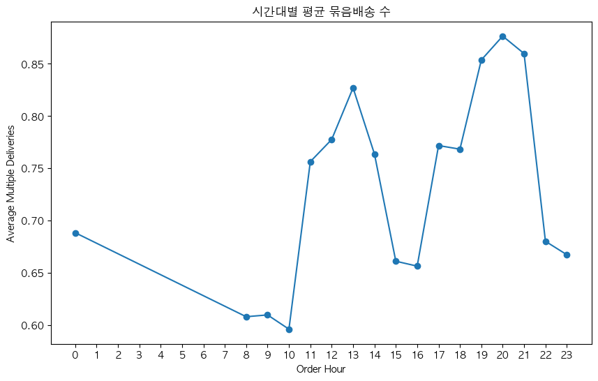
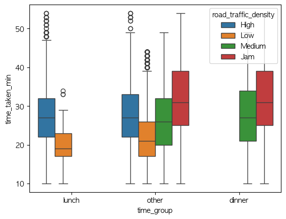

배달 소요시간에 영향을 미치는 요소를 확인하기 위해 분석을 수행했습니다.

먼저 시간대별 주문량과 평균 배달 소요시간을 확인하여 시간대에 따른 배달 지연 패턴을 살펴보았습니다.

분석 결과, 11–16시 구간에서 주문량 대비 평균 배달 소요시간이 상대적으로 높게 나타나는 현상이 관찰되었습니다.

그러나 시간대별 소요시간 분포를 추가로 확인한 결과, 일부 이상치(outlier)가 평균값을 상승시킨 것으로 확인되었습니다. 

따라서 해당 구간의 평균 소요시간 증가는 전반적인 지연 현상이라기보다는 일부 특이 사례의 영향으로 판단되었습니다.

또한 11–14시와 18–21시 구간에서 주문량이 가장 높은 피크 시간대로 나타났습니다. 

이에 따라 해당 시간대의 배달 소요시간에 영향을 줄 수 있는 요인을 확인하기 위해 묶음 배달 관련 분석을 추가로 수행했습니다.

분석 결과, 묶음 배달 수가 증가할수록 평균 배달 소요시간이 증가하는 경향이 확인되었으며 1개의 묶음 배송의 배달수가 높게 나왔습니다

이후 배달 소요시간에 영향을 줄 수 있는 또 다른 요인으로 교통 상황을 함께 고려하여 분석을 진행했습니다.

 

피크 시간대인 11–14시와 18–21시 구간의 교통량을 함께 살펴본 결과,
점심 시간대에는 high와 low 수준의 교통량이 혼재되어 나타났으며,

저녁 시간대에는 medium과 jam 수준의 교통 혼잡이 더 자주 관찰되었습니다.

이를 통해 저녁 시간대에는 주문량 증가와 함께 교통 혼잡이 배달 소요시간 증가에 영향을 미칠 가능성이 있는 것으로 판단됩니다.

따라서 저녁 피크 시간대에는 교통 상황을 고려하여 라이더 수요를 확대하거나 배달을 분산하는 운영 전략이 필요할 것으로 보입니다.